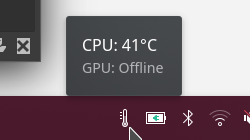
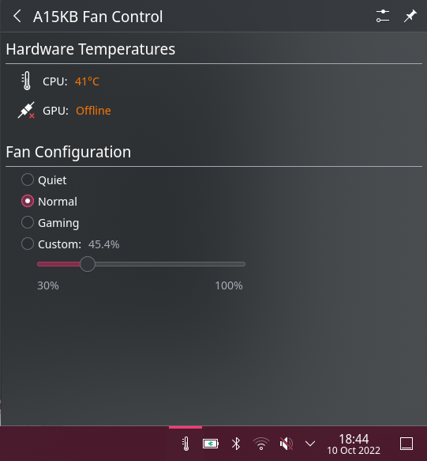

# A15KB

A15KB consists allows convienent control of Gigabyte AERO 15 KB laptops' fans on Linux. 
It consists of a D-Bus/`systemd` service, a fan control REPL, and (where supported) a KDE Plasma applet
which lives in your system tray. 

This is built upon the reverse engineering work of [@tangalbert919](https://github.com/tangalbert919/p37-ec-aero-15/).

**THIS SOFTWARE IS PROVIDED WITH ABSOLUTELY NO WARRANTY. USING THIS COULD PERMANENTLY DAMAGE YOUR HARDWARE.**

# Dependencies

You'll need a new-ish version of Rust installed to compile the project.
The installation scripts will fetch all needed Rust dependencies via invoking `Cargo`. 

The server uses `modprobe` to load `ec_sys` at runtime, so make sure both `modprobe` and `ec_sys` are present.
It also uses D-Bus and `systemd`.

# Installation

You can install the server by running `./install_server.sh`. 
The install script will enable and start the server once it's done.

You can then install the Plasma applet by running `./install_applet.sh`.

The REPL doesn't need to be installed. If you want to use it, execute `cargo run --example a15kb-repl`.
It's mostly meant as a debugging tool.

There isn't a built-in CLI because all functionality is exposed over D-Bus. 
This means that you can use generic D-Bus tools to communicate with a15kb. 
For example, here's how you can set the fans to `normal` using `busctl`:

`busctl set-property com.offbyond.a15kb /com/offbyond/a15kb/Controller1 com.offbyond.a15kb.Controller1 FanMode y 1`

# Usage (Applet)

First, install the server and the applet. You can then add the applet to your system tray in the normal manner.
The applet updates every second to reflect the current fan configuration and thermal state.
The applet will remove itself from the system tray if it can't connect to the server, and will add itself back
once the connection is re-established.

# Usage (Server)

The server functionality is documented in `a15kb.Controller1.xml` -- in fact, this is the introspection definition
that the D-Bus bindings are generated from! It runs under a system service named `com.offbyond.a15kb`. 

There is also a convienent Rust client interface exposed in `lib.rs` which is used by both the REPL and the Plasma applet.

# Does this work on other Aero models?

Probably. The embedded controller analysis I referenced was actually for a different model of Aero 15,
so if it worked on my model, there's a pretty good chance it will work on yours too. 

**However,** in the interest of safety, the server will refuse to start on any laptop other than the AERO 15 KB. 
If you want to try it out anyways, you can disable the safety check in `ec::Ec::new()`. 
I take no responsibility if it sets your laptop on fire or deletes your family photos or turns into a Decepticon.

# Why can't I set the custom fan mode below 30%?

This is a software restriction I added because I heard it can be unsafe. 
You can change it by editing `ec::FAN_FIXED_SPEED_MIN` in `src/ec.rs` and reinstalling the server.
(You can also change the max fan speed, although I don't know why you'd want to.)

# Why doesn't the server send signals when the fan state changes?

Software can sneakily update the fan mode by directly talking to the embedded controller.
There's no way for the server to detect this other than by continually monitoring the fan mode.
As a result, if you want to make sure the fan mode is up-to-date, you can't wait for a signal;
you must continuously poll this property.
